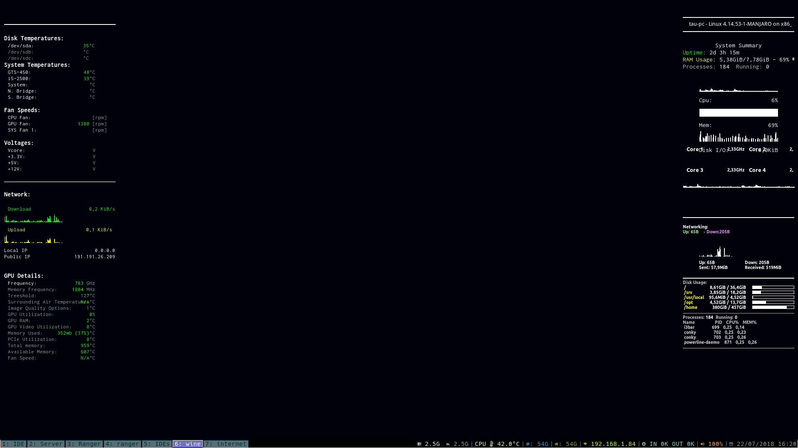

# Tonky, My personal Conky setup

This are my scripts and config files for Conky. It is intended to serve as a backup for my configuration, but it should work on any system, so if you like it, feel free to use it as you will.

** It has: **
* CPU, GPU, RAM & Disk Usage Stats;
* CPU, GPU & Disks Temperature values, colorized by range;
* System, CPU and GPU Fan status;
* Network stats with graphs for Download and Upload activity;
* Processes info;
* Detailed panel with Nvidia Card info;
* Transparency, so it should combine with any dark background.

# Installation
To install clone this repo with:
    `git clone https://github.com/gugutz/tonky.git ~/.conky`

### xinitrc

Add `scripts/conky-start` to your `xnitrc` file:
    `echo "~/.conky/tonky/scripts/conky-start.sh" >> ~/.xinitrc`

### i3-gaps Window Manager

Add `scripts/conky-start` to your `xnitrc` file:
    `echo "exec_always --no-startup-id ~/.conky/tonky/scripts/conky-start.sh" >> ~/.config/i3/config`

## Screenshots

